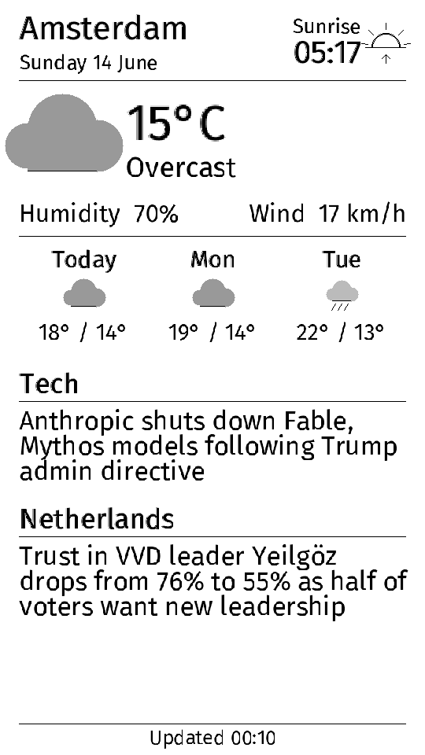
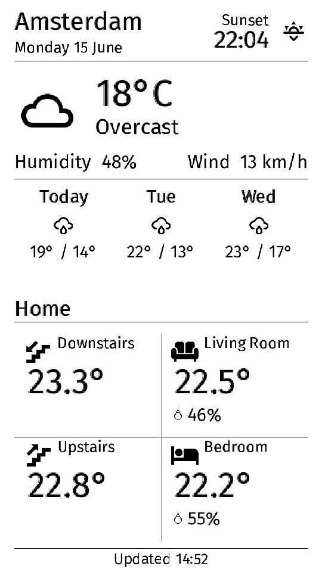

# T5 Smart E-Paper Frame

Firmware for the **LilyGo T5 4.7" E-Paper V2.3 (ESP32-S3)** that turns the
display into a Wi-Fi controlled device with three modes:

1. **Photo frame** — upload images from a browser; they're shown as a slideshow.
2. **Digest** — live local weather (Open-Meteo, no API key), sunrise/sunset, and
   two rotating news headlines from feeds you choose (any RSS/Atom), drawn
   natively on the panel in **portrait** orientation.
3. **Smart Home** — the same weather block on top, with a 2×2 grid of
   configurable **metric tiles** from **Home Assistant** — room climate
   (temp/humidity), or any entity: NAS storage, voltage, power, battery, CO₂… Each
   tile has a **type** (unit/format) + a pickable **icon** + free-text label. See
   [docs/home-assistant.md](docs/home-assistant.md).

Works in any region: set your coordinates and pick news feeds in the web UI —
the weather, sunrise/sunset and city name are all derived automatically.

Everything is controlled from a built-in web interface on your local network —
no app, no cloud account. The web UI is embedded in the firmware, so a single
`upload` is all you need.

```
http://t5frame.local        (or the device IP shown on screen)
```

---

## Screenshots — the three modes

  

*Left → right: **Photos** (browser-dithered image), **Digest** (weather +
sunrise/sunset + rotating news headlines), **Smart Home** (Home Assistant metric
tiles). All captured live from `/api/fb`; in the web UI, **Settings → 📷
Screenshot** exports the current screen as a PNG. (Photo sample via
[Lorem Picsum](https://picsum.photos).)*

## Hardware

| | |
|---|---|
| Board | LilyGo T5 4.7" E-Paper **V2.3** |
| MCU | ESP32-S3-WROOM-1 (16 MB flash, 8 MB PSRAM) |
| Panel | 4.7" ED047TC1, **960 × 540**, 16-level grayscale |
| USB | USB-C, **native USB** (appears as `/dev/cu.usbmodem*` / `COMx`) |

### ⚠️ Before flashing: use a DATA USB-C cable

The ESP32-S3 enumerates over USB instantly on macOS/Windows/Linux — no driver
needed. If the board does **not** show up as a serial port, it's almost always a
**charge-only cable**. Verify it's detected:

```bash
# macOS
ls /dev/cu.usbmodem*
# Linux
ls /dev/ttyACM*
```

If nothing appears: swap the cable, then tap the **RST** button.

---

## Build & flash (PlatformIO)

```bash
# Build only (validates everything compiles)
pio run -e T5-ePaper-S3

# Build + flash over USB
pio run -e T5-ePaper-S3 -t upload

# Watch serial logs (115200 baud)
pio device monitor
```

> Always pass `-e T5-ePaper-S3` — a bare `pio run` also builds the
> `T5-ePaper-S3-ota` env, which can't flash over USB (it targets `t5frame.local`).

The board definition lives in `boards/T5-ePaper-S3.json`; the partition layout
(`partitions_custom.csv`) gives ~8.8 MB of LittleFS for photos plus dual-OTA app
slots.

If `upload` can't find the port, hold **BOOT**, tap **RST**, release **BOOT** to
force download mode, then upload again.

### Updating over Wi-Fi (OTA) — no cable after the first flash

Once the firmware is installed, you can update wirelessly two ways:

- **From the browser:** Settings tab → **Firmware update (OTA)** → pick
  `.pio/build/T5-ePaper-S3/firmware.bin` → **Flash firmware**. The device shows
  an "updating" screen, flashes, and reboots.
- **From PlatformIO:**
  ```bash
  pio run -e T5-ePaper-S3-ota -t upload      # pushes to t5frame.local
  ```

The current firmware version is shown in the Settings tab and in `/api/status`
(`FW_VERSION` in `src/config.h`). Dual-OTA partitions mean a bad image won't
brick the board — it falls back to the previous slot.

---

## First boot — Wi-Fi onboarding

1. On first power-up (no saved Wi-Fi) the screen shows a setup message and the
   device starts a Wi-Fi access point:
   - **SSID:** `T5-Frame-Setup`
   - **Password:** `lilygo123`
2. Join that network from your phone/laptop. A captive page opens (or browse to
   `http://192.168.4.1`).
3. Enter your home Wi-Fi SSID + password → **Save & connect**. The device
   reboots and joins your network.
4. From then on, open **`http://t5frame.local`** (the IP is also shown on the
   panel and printed to serial).

> Hold the on-board button (**GPIO21**) for ~2.5 s at any time to erase Wi-Fi and
> return to setup mode. A short press cycles **Photos → Digest → Smart Home**.

---

## Using it

### Photo frame
- **Photos** tab → choose an image. It's resized to portrait **540×960**,
  converted to grayscale and **dithered in your browser** (Floyd–Steinberg), with
  brightness / contrast / fit (crop vs letterbox) controls and a live preview.
- **Upload to frame** stores it on the device.
- The gallery lets you **Show** a specific photo or **Delete** it.
- Set the **slideshow interval** and hit **Cycle all photos** to rotate through
  the library automatically.

Because dithering happens in the browser, the device just stores and blits ready
4-bit framebuffers — fast, and no on-device JPEG decoding.

### Digest — weather & news (portrait)
- **Digest** tab → set your **location** (type lat/lon or hit *Use my
  location*), choose **two news blocks** (pick a type — Tech / World / Business /
  Science / Sport / Regional — from the dropdown, or "Custom…" for any RSS/Atom
  feed), set the **refresh interval** and a POSIX **timezone**.
- The **city name is detected automatically** from the coordinates (reverse
  geocoding), so no manual naming.
- Layout: city + **sunrise/sunset** (the next event, with icon), large
  temperature + condition icon, humidity/wind, 3-day forecast, then **one
  rotating headline per block** (advances each refresh).
- **Save & show now** switches the display and renders immediately.
- Weather + sun times come from [Open-Meteo](https://open-meteo.com) (free, no
  key); the city from [BigDataCloud](https://www.bigdatacloud.com) (free, no key).

**Refresh / rotation:** the dashboard re-fetches weather + news and rotates to
the next headline every `metricsRefresh` minutes (default **15**). Each refresh
fully repaints the e-paper, so don't set it too low.

### Smart Home — Home Assistant tiles
- **Smart Home** tab → enter your HA base URL + a **long-lived token**, then
  configure the four **tiles**. Each tile has a **type** (Climate / Temperature /
  Humidity / Storage / Voltage / Power / Battery / CO₂ / Pressure / Custom — sets
  unit & format), a free-text **label**, a **pickable icon** (visual picker,
  ~45 icons), and the HA **`entity_id`** (plus a 2nd entity for humidity on the
  Climate type).
- The weather block stays on top; the lower 2×2 grid shows the tiles, refreshed on
  the same interval as Digest.
- Full setup + controlling the frame from HA (`rest_command`): see
  [docs/home-assistant.md](docs/home-assistant.md).

---

## HTTP API (for automation)

All POST bodies are JSON unless noted.

| Method | Path | Body | Action |
|---|---|---|---|
| GET  | `/api/status` | — | Full state: settings, photos, IP, heap, FS, version |
| GET  | `/api/fb` | — | Raw 960×540 4-bit framebuffer (for screenshots) |
| POST | `/api/upload?name=<f>.bin` | raw bytes | Upload a 259200-byte 4-bit framebuffer |
| POST | `/api/update` | raw `firmware.bin` | OTA firmware update, then reboot |
| POST | `/api/photo/show` | `{"name":"x.bin"}` | Pin + display a photo |
| POST | `/api/photo/delete` | `{"name":"x.bin"}` | Delete a photo |
| POST | `/api/photo/cycle` | `{}` | Un-pin → slideshow cycles all |
| POST | `/api/mode` | `{"mode":0\|1\|2}` | 0 = Photos, 1 = Digest, 2 = Smart Home |
| POST | `/api/settings` | partial settings | Update + persist settings |
| POST | `/api/refresh` | `{}` | Redraw current mode now |
| POST | `/api/wifi` | `{"wifiSsid":..,"wifiPass":..}` | Set Wi-Fi + reboot |
| POST | `/api/reboot` | `{}` | Reboot |

**Photo file format:** exactly `960*540/2 = 259200` bytes, 4-bit grayscale,
2 px/byte — **even-x pixel = low nibble, odd-x = high nibble**, value `0..15`
(`0` = black, `15` = white). This matches `epd_draw_grayscale_image()`.

---

## Project layout

```
platformio.ini             build config + lib deps
boards/T5-ePaper-S3.json    board definition
partitions_custom.csv       16 MB flash map (big LittleFS)
src/
  config.h                  geometry + constants
  settings.{h,cpp}          persistent settings (settings.json)
  display.{h,cpp}           LilyGo-EPD47 wrapper + framebuffer
  storage.{h,cpp}           LittleFS photo store
  metrics.{h,cpp}           Open-Meteo + geocode + RSS fetch + Digest layout (shared top block)
  homeassistant.{h,cpp}     Smart Home mode: HA REST tiles + type/icon catalog
  icons.h                   Material Design Icons subset (GFXfont) — weather + tile icons
  modes.{h,cpp}             slideshow / refresh timers + mode dispatch
  web.{h,cpp}               async server + JSON/upload API
  web_assets.h              embedded SPA + setup page (PROGMEM)
  main.cpp                  boot, Wi-Fi onboarding, button, loop
docs/
  ARCHITECTURE.md           internal developer documentation (module map, pipelines, gotchas)
  home-assistant.md         HA control (mode switching) + Smart Home tiles setup
```

For the full architecture (rendering engine, photo/metrics pipelines, data
formats, lessons learned) see [`docs/ARCHITECTURE.md`](docs/ARCHITECTURE.md).

---

## Notes & ideas for later

- **Battery:** the device stays awake to serve the web UI. For battery use you'd
  add deep-sleep between refreshes (the panel keeps its image with no power), at
  the cost of the always-on web server.
- **Fonts & icons:** text is the bundled `FiraSans`, rendered by a custom blitter
  that rotates it into portrait and **scales it to any size** (so the temperature
  is drawn large from the same font). Icons are a Material Design Icons subset;
  add more by extending the codepoint list and re-running `fontconvert`.
- **Server-rendered dashboards:** if you later want pixel-perfect HTML/CSS
  dashboards, render them to a 540×960 portrait image on a server you run,
  convert to the 4-bit format above, and POST to `/api/upload` + `/api/photo/show`.

## Credits
- [LilyGo-EPD47](https://github.com/Xinyuan-LilyGO/LilyGo-EPD47) display driver
- [ESPAsyncWebServer](https://github.com/ESP32Async/ESPAsyncWebServer)
- [Open-Meteo](https://open-meteo.com) weather API · [BigDataCloud](https://www.bigdatacloud.com) reverse geocoding
- Icons: [Material Design Icons](https://pictogrammers.com/library/mdi/) (Apache-2.0), subset into a GFXfont via the EPD `fontconvert` tool
